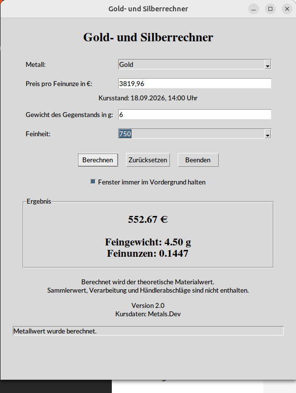
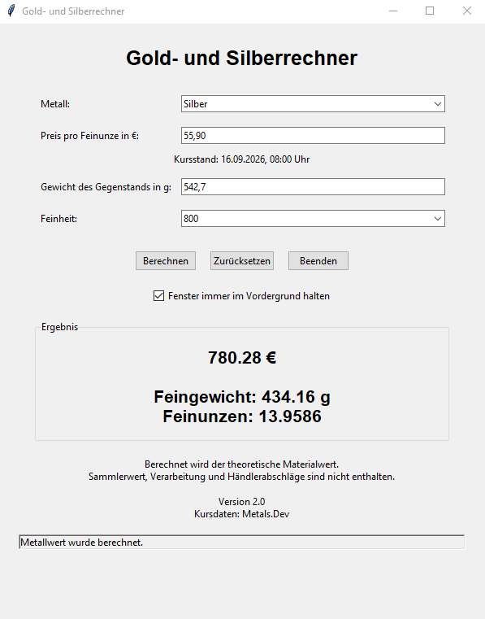

# Gold- und Silberrechner

Der **Gold- und Silberrechner** ist eine kostenlose Anwendung zur Berechnung des Materialwerts von Gold und Silber anhand aktueller Edelmetallkurse.

Die Anwendung eignet sich zum Beispiel zur Bewertung von Münzen, Barren, Schmuck und anderen Gegenständen aus Gold oder Silber.

## Version

Aktuelle Version: **2.0**

## Download

Die aktuelle Version 2.0 steht über die GitHub-Releases zur Verfügung:

https://github.com/media-vm/gold-silber-rechner/releases

### Windows

Für Windows steht eine ausführbare EXE-Datei bereit:

`Gold-Silber-Rechner-2.0.exe`

Die Anwendung kann direkt gestartet werden.

### Debian / Ubuntu

Für Debian-basierte Linux-Systeme steht ein DEB-Paket zur Verfügung:

`gold-silber-rechner_2.0-1_all.deb`

Installation:

```bash
sudo apt install ./gold-silber-rechner_2.0-1_all.deb
```

### Snap

Für Linux steht außerdem ein Snap-Paket zur Verfügung:

`gold-silber-rechner_2.0_amd64.snap`

Lokale Installation:

```bash
sudo snap install --dangerous ./gold-silber-rechner_2.0_amd64.snap
```

Die Anwendung ist außerdem über den Snap Store erhältlich.

### Android

Für Android steht eine APK-Datei zur Verfügung:

`gold-silber-rechner-2.0.apk`

Bei direkter Installation der APK kann Android eine Bestätigung für die Installation aus einer externen Quelle verlangen.

### Projekt-Webseite

Weitere Informationen und Downloads:

https://linuga.org/gsr/

## Funktionen

- Berechnung des Materialwerts von Gold und Silber
- Eingabe des Gewichts
- Auswahl bzw. Eingabe der Feinheit
- Berechnung des enthaltenen Feingewichts
- Verwendung aktueller Gold- und Silberkurse
- übersichtliche grafische Oberfläche
- Unterstützung verschiedener Betriebssysteme

## Unterstützte Plattformen

Der Gold- und Silberrechner ist für mehrere Plattformen verfügbar:

- Windows
- Linux
- Android

Je nach Plattform stehen unterschiedliche Installationspakete zur Verfügung, darunter:

- Windows EXE
- Windows MSIX
- Debian DEB
- Snap
- Android APK

## Screenshots

### Linux



### Windows



## Quellcode

Die Desktop-Version wurde in **Python** entwickelt.

Die grafische Benutzeroberfläche verwendet Tkinter.
Die Datei `gold-silver-value-calculator-german-v2.0.py` enthält den Quellcode der Desktop-Version 2.0.

## Code signing policy

Free code signing provided by SignPath.io, certificate by SignPath Foundation.

### Project roles

- Author / Committer: Volker Andreas Müller
- Reviewer: Volker Andreas Müller
- Approver: Volker Andreas Müller

### Privacy policy

This program does not collect or transmit personal user data.

The application connects to the project's server at `https://gsr.linuga.org/` only to retrieve the current gold and silver prices required for its intended functionality.

## Lizenz

Dieses Projekt steht unter der MIT License.

Siehe die Datei `LICENSE` im Repository.
